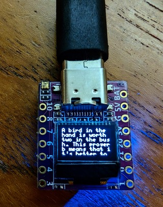

# Kresmo

Kresmo refers to Χρησμός, of ancient Greek oracular fame. Seekers came to speak to Pythia, the Oracle at Delphi, to gain wisdom and advice, but often left with puzzling pronouncements that had ambigious interpretations.

Now that we now have Large Language Models, we don't have to chew bay leaves and inhale the osmic steam emerging from the chasm, unless of course you want to.

Kresmo is an Arduino sketch that uses an OpenAI-compatible API to
generate a random and brief pithy saying. The sketch uses the U8g2
library for displaying text on an OLED screen, and the WiFi library
for connecting to the internet. The ESP32-C3-0.42 module combines all
this hardware into one tiny board.



## Hardware Requirements
- ESP32-C3-0.42 RISC-V CPU with Wifi annd LCD

## Configuration

Before running the sketch, you need to configure the following settings in the `config.h` file:

```
#define ssid "your_network_ssid"
#define pass "your_network_password"
#define server "localllm.example.com"
#define port 5000
#define path "/v1/generate"
```

There's no provision for authentication, so you will have to add one if you use openAI or other public API endpoints.

## Usage
The sketch will connect to the internet and display a random and brief pithy saying on the OLED screen.

## Credits
This sketch was created by Leigh Klotz (WA5ZNU) and is based on the Arduino WiFi Client and the ESP32-C3-0.42LCD examples.

## Future Work
- better word wrapping and scrolling
- add a magnifying lens and put in a mysterious case
- prompt tuning, perhaps take into account some current conditions via local httP GET and inject into prompt
- Use a bigger screen

## References
- https://el.wikipedia.org/wiki/Χρησμός
- https://github.com/01Space/ESP32-C3-0.42LCD
- https://github.com/oobabooga/text-generation-webui
